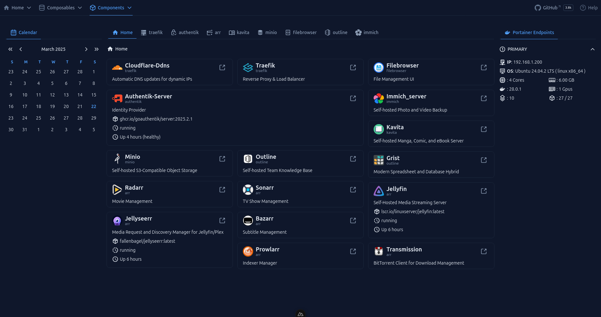

# Muraqib

Muraqib is a **Nuxt 3** application designed for monitoring and managing various services such as **Portainer, Proxmox, Sonarr, Radarr,** and more.

## Screenshot



## Features

- [ ] 🔄 **Dashboard** with real-time monitoring
- [ ] 🔄 **Portainer Integration** to manage Docker endpoints
- [ ] ❌ **Proxmox Support** for virtualization management
- [ ] ❌ **Sonarr/Radarr API Support** for media automation
- [ ] ❌ **OIDC Authentication** via Authelia or OAuth2 Proxy
- [ ] ❌ **SQLite-based Content Storage** for logs and persistent data


## Installation

### Prerequisites

Ensure you have the following installed:

- **Node.js v18+**
- **Yarn** (recommended) or NPM
- **Docker** (for services like Portainer & Proxmox)

### Setup

1. Clone the repository:
   ```sh
   git clone https://github.com/yourusername/muraqib.git
   cd muraqib
   ```
2. Install dependencies:
   ```sh
   yarn install
   ```
3. Copy environment variables:
   ```sh
   cp .env.example .env
   ```
4. Run the development server:
   ```sh
   yarn dev
   ```

## Configuration

Edit `.env` to configure API endpoints:

```env
PORTAINER_BASE_URL="https://portainer.example.com"
PORTAINER_X_API_KEY="XXXXXXXXXXXXXXXXXXXXXXXXX"
```

## Deployment

To deploy with **Nitro** and **Docker**, use:

```sh
yarn build
yarn start
```

## License

This project is licensed under the MIT License.

