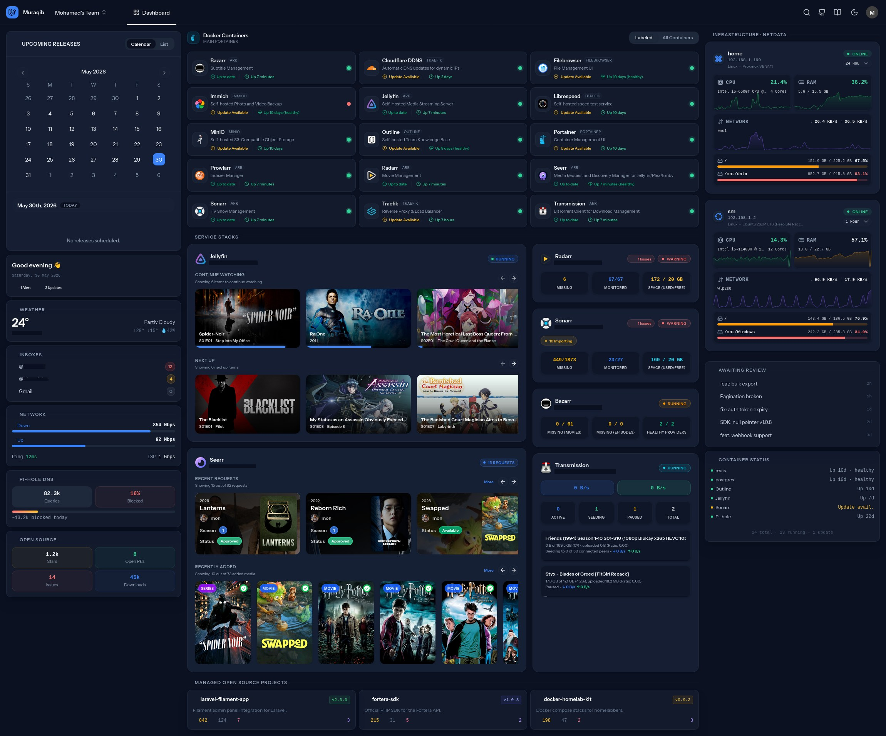

# Muraqib

<div align="center">

[](https://github.com/slimani-dev/muraqib/actions/workflows/tests.yml)
[](LICENSE)


**The Ultimate Sentinel for your Cloud & Infrastructure.**

[Features](#features) • [Installation](#installation) • [Screenshots](#screenshots) • [Contributing](#contributing) • [License](#license)

</div>

---

## 📖 About Muraqib

**Muraqib** (meaning "Observer" or "Supervisor") is a cutting-edge centralized dashboard designed to unify your infrastructure management. Built on the robust **Laravel 13** framework and energized by **Filament 5**, Muraqib provides a single pane of glass for monitoring servers, managing cloud access, and orchestrating containerized environments.

Stop juggling multiple portals. Monitor your Netdata instances, manage Cloudflare Zero Trust policies, and oversee Portainer stacks from one beautiful, responsive interface.

## ✨ Key Features

### 🛡️ Cloudflare Zero Trust Integration
Seamlessly manage your Zero Trust architecture without leaving the dashboard.
- **Access Policies & Applications**: Create, update, and audit access rules.
- **Service Tokens**: Manage lifecycle and permissions for service-to-service authentication.
- **Deep Integration**: Real-time sync with Cloudflare API.

### 📊 Netdata Monitoring
Keep a pulse on your infrastructure with real-time telemetry.
- **Live Dashboards**: View key metrics (CPU, RAM, Network) at a glance.
- **Disk & Network Widgets**: Specialized widgets for checking storage health and traffic flow.
- **Seamless Connectivity**: Aggregate stats from multiple Netdata nodes.

### 🐳 Portainer & Docker Management
Orchestrate your containers with ease.
- **Stack & Container Visualization**: Inspect running stacks and container states.
- **Sync & Updates**: Track version drifts and sync states with your Portainer instances.
- **Health Checks**: Instant specific container health status visibility.

### ⚡ Modern Tech Stack
Built with developer experience and performance in mind.
- **Laravel 13**: The latest and greatest PHP framework.
- **Filament 5**: The gold standard for TALL stack admin panels.
- **Inertia.js & Vue 3**: A silky smooth, SPA-like frontend experience.
- **Tailwind CSS 4**: Beautiful, modern styling by default.

## 📸 Screenshots

<div align="center">
  
</div>

## 🚀 Installation

### Prerequisites
- PHP 8.3+
- Composer
- Node.js & PNPM
- SQLite (default), MySQL or PostgreSQL

### Setup Guide

1. **Clone the repository**
   ```bash
   git clone https://github.com/slimani-dev/muraqib.git
   cd muraqib
   ```

2. **Install Dependencies**
   ```bash
   composer install
   pnpm install
   ```

3. **Configure Environment**
   ```bash
   cp .env.example .env
   php artisan key:generate
   ```
   *Edit `.env` with your database settings (see [Configuration](#-configuration)).*

4. **Initialize Database**
   ```bash
   php artisan migrate --seed
   ```
   The seeder creates an `admin@example.com` / `password` account. **Change it immediately** on any instance reachable from a network.

5. **Build Assets**
   ```bash
   pnpm run build
   ```

6. **Serve**
   ```bash
   php artisan serve
   ```

## 🛠️ Configuration

### Cloudflare, Portainer & Netdata
Accounts and instances are managed directly via the admin panel. Log in as an administrator to add your first Cloudflare account, Portainer endpoint or Netdata node. API tokens entered in the UI are stored encrypted using your `APP_KEY`.

### Media Stack (optional)
Jellyfin, Seerr, Radarr, Sonarr, Bazarr and Transmission are added in the admin panel under **Media Services** → **New** (as many of each as you run). Each enabled service gets its own dashboard widget. API keys and passwords are stored encrypted and only used by the server; the browser only checks whether each service is accessible.

Upgrading from a version that read `JELLYFIN_URL`, `RADARR_API_KEY`, … from `.env`? Run `php artisan media:import-env` once, then remove those lines.

## 🧪 Testing

```bash
php artisan test --compact
```

Some integration tests hit live Cloudflare/Portainer/Netdata APIs. They are skipped unless you copy `.env.testing.example` to `.env.testing` and fill in test credentials.

## 🤝 Contributing

We welcome contributions! Please see [CONTRIBUTING.md](CONTRIBUTING.md) for details on how to submit pull requests, report issues, and suggest improvements.

1. Fork the Project
2. Create your Feature Branch (`git checkout -b feature/AmazingFeature`)
3. Commit your Changes (`git commit -m 'Add some AmazingFeature'`)
4. Push to the Branch (`git push origin feature/AmazingFeature`)
5. Open a Pull Request

## 📄 License

This project is open-sourced software licensed under the **[MIT license](LICENSE)**.

---

<div align="center">
    <sub>Built with ❤️ by Moh</sub>
</div>
